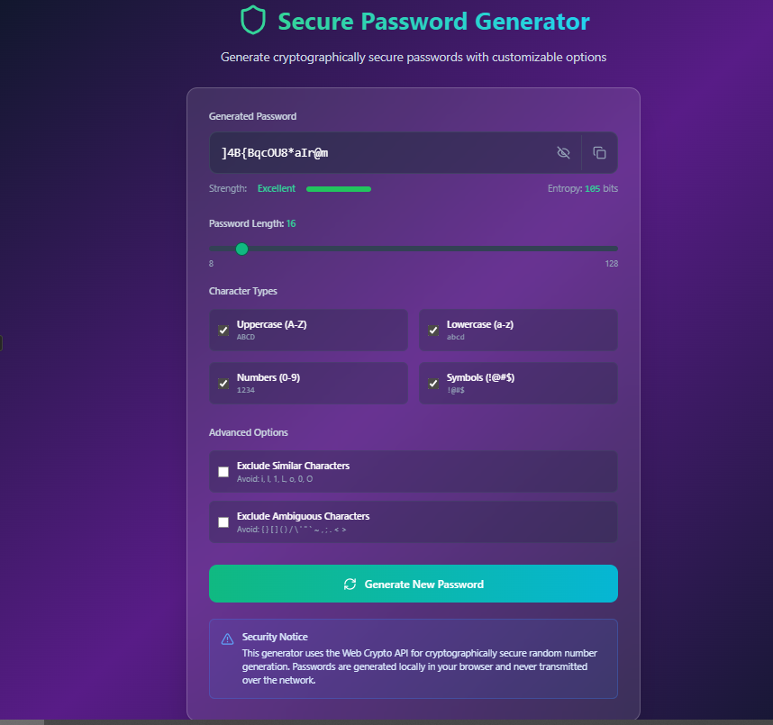
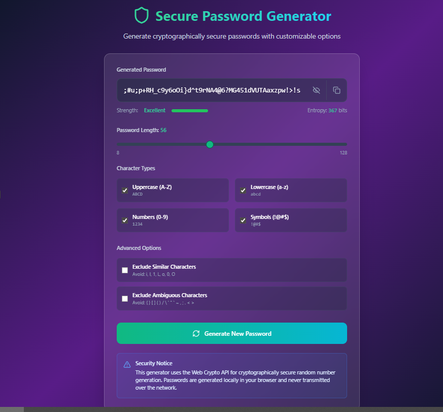

# SecurePass - Cryptographically Secure Password Generator

A modern, secure password generator built with **React** that uses the **Web Crypto API** for cryptographically secure random number generation.

---

## 🔒 Security Features

- **Cryptographically Secure**: Uses `crypto.getRandomValues()` for true randomness  
- **Local Generation**: Passwords generated entirely in your browser  
- **No Network Transmission**: Never sends data over the internet  
- **Entropy Calculation**: Real-time password strength assessment  
- **Fisher-Yates Shuffle**: Ensures uniform distribution of characters  

---

## 🚀 Features

- **Customizable Length**: 8–128 characters  
- **Character Options**: Uppercase, lowercase, numbers, symbols  
- **Advanced Filtering**: Exclude similar/ambiguous characters  
- **Visual Strength Indicator**: Real-time password strength scoring  
- **One-Click Copy**: Clipboard integration with visual feedback  
- **Password History**: Track recently generated passwords  
- **Responsive Design**: Works on desktop and mobile  
- **Accessibility**: Full keyboard navigation and screen reader support  

---
## Screenshots

  



---

## 🛠 Installation

1. Clone the repository:  
```bash
git clone https://github.com/yourusername/secure-password-generator.git
cd secure-password-generator


